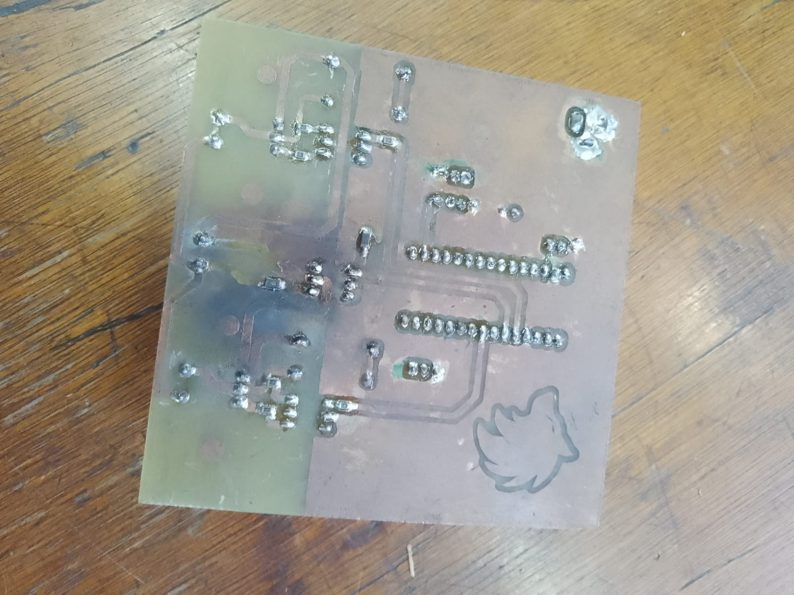
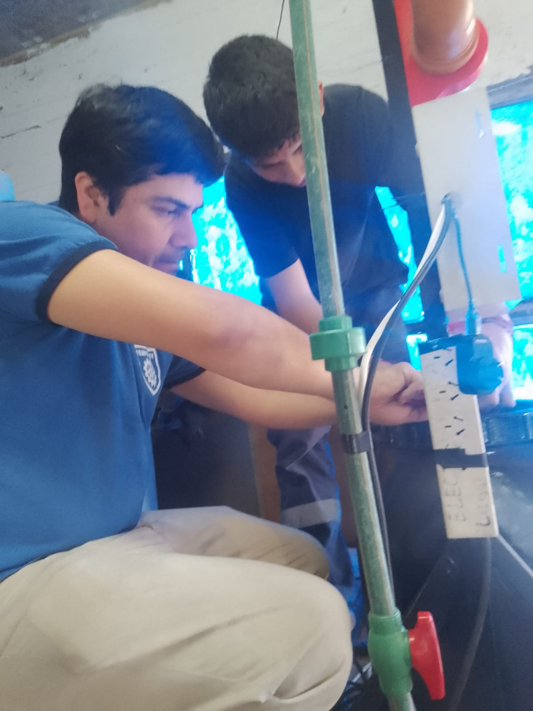
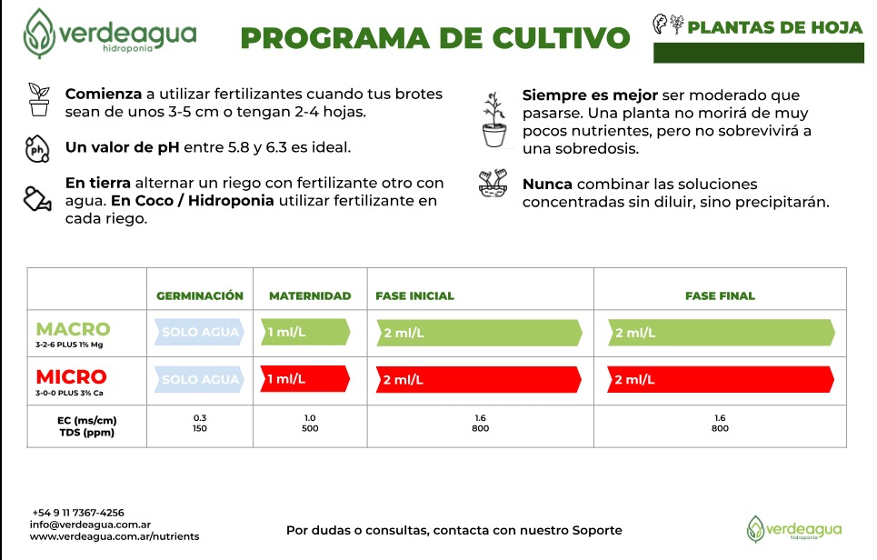
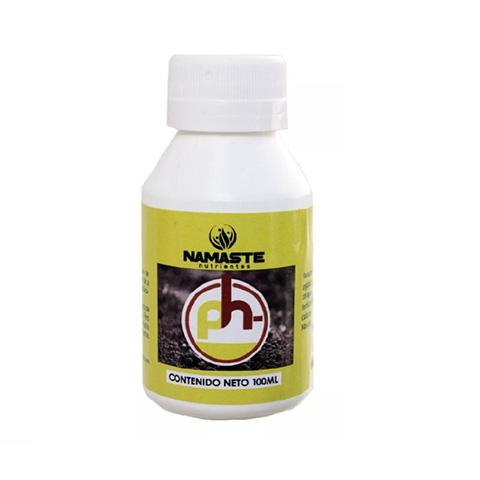

## Explosión XD (De vuelta)

El circuito explotó nuevamente. ¿Por qué? Faltaban una serie de cambios en el PCB (solo un diodo xD) nadie entendió como no sucedió antes. En conclusión: que epico.

## Representación gráfica del suceso

## Momentos antes del desastre XD

## Avances

Dejamos bombeando el agua unos dias con la intención de que el cloro se evaporará y poder finalmente regular el PH del agua. 

Pero... ¿Por qué todo esto? Si el lector no está familiarizado con el funcionamiento de una Hidroponia en general, le será importante leer lo que escriba a continuación:

## Hidroponia

Una hidroponia es, en esencia, el arte de cultivar plantas sobre una superficie sólida a la que solo tendrá acceso una corriente de agua. Pero esto da una *gran* serie de problemas al no ser del todo natural; uno de ellos es el nivel de PH del agua, pero primero para ello debemos de conocer que es el PH.

El "PH" es una unidad logarítmica del 1-14 que regula el nivel de acidez y alcalinidad de "algo", siendo en este caso: agua. A menor nivel este se encuentre, mayor será el nivel de ácidez que contendrá ese "algo" y a mayor nivel se encuentre, mayor será el nivel de alcalinidad.

El nivel de PH adecuado para cada contexto depende del tipo de planta a plantar, y son muchas las soluciones que pueden afectar el nivel de PH del agua. En nuestro caso concreto quisimos plantar lechuga, siendo su valor recomendado un rango de entre un **5.8 - 6.3** de PH. 

A su vez, las soluciones nutritivas que utilizamos son las [Micro y Macro](https://www.verdeagua.com.ar/productos/kit-nutrientes-hidroponia-verdeagua-macro-y-micro/) de la empresa [Verdeagua.](https://www.verdeagua.com.ar/)

Es importante tener en cuenta también que las soluciones nutritivas que necesita cada planta, independientemente de cual sea, también **alteran el PH**. Así que *teganlo en cuenta*. En nuestro caso para regularlo fue mayormente a prueba y error.

---

Nuestro problema fue sencillo de resolver: el PH del agua del colegio *era muy alto* y teniamos que reducirlo, para ello compramos un reductor de PH, lo que en esencia es un ácido, nosotros utilizamos concretamente el [Namaste PH.](https://www.estoyverde.com.ar/fertilizantes/namaste-ph-100-ml.)

El mismo lo compramos en Lomas, concretamente en la tienda [Estoy Verde](https://www.estoyverde.com.ar/) tienda la cual recomendamos encarecidamente. Su atención es *muy* buena y su dueño nos resolvió una gran cantidad de dudas respecto al buen armado de una hidroponia. 

Estamos muy satisfechos y nos enorgulleceria mucho el que nuestra recomendación pudiese, al menos, producirles una venta.

