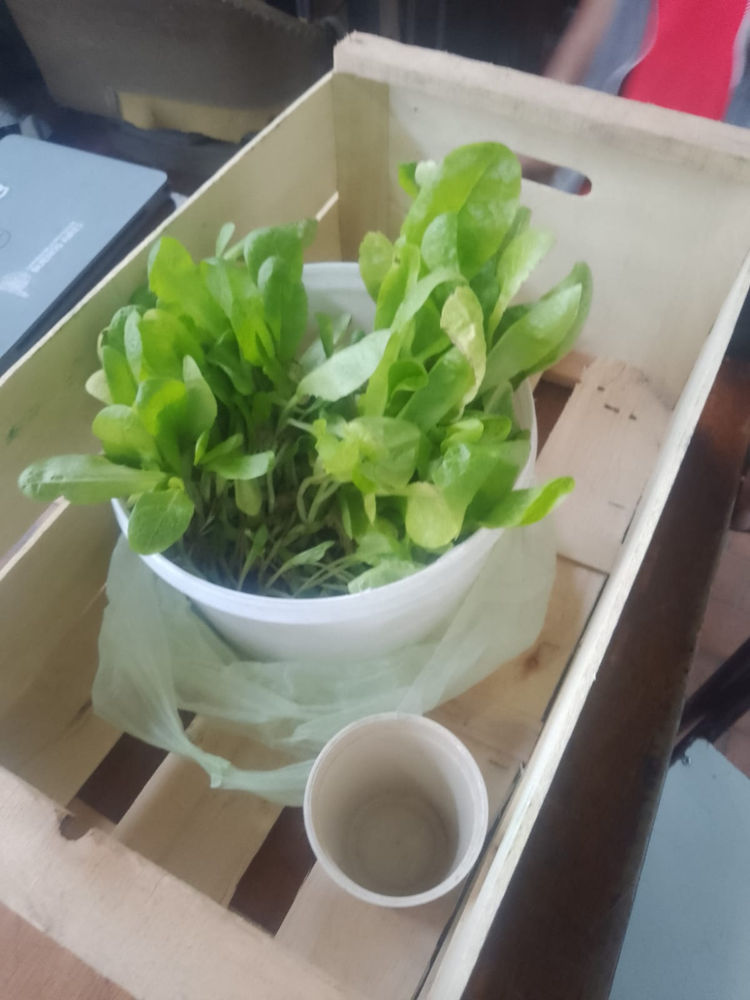

## Armado

Los últimos dias anduvimos trabajando en diseñar e imprimir los modelos 3D que contendrán tanto la placa como la Raspberry Pi y a su vez solucionando problemas con la bomba; esta se prendía y apagaba por el sobrecalientamiento. Esto es un problema gigantezco en una hidroponia; si la bomba se apaga, los plantines *mueren*. 

La bomba no debe dejar de bombear por mucho tiempo, así que como solución para que no se sobrecalentara decidimos utilizar un disparo de nuestra placa para ir prendiendola y apagandola de forma intermitente. Fue justo en esta prueba donde nuestra placa hace unos dias explotó (en el momento menos conveniente posible), pero rápidamente lo solucionamos.

Utilizamos el timer para calcular un aproximado de 5 minutos de prendido y apagado utilizando la función de GradoZero() de nuestro código. Esa función se ejecuta cada 180° de la onda senoidal, justamente al cambiar de polaridad, teniendo en cuenta dicho dato y teniendo en cuenta que cada 1ms hay un cambio de polaridad, utilizamos un contador que fuese incrementandose hasta un valor apróximado al número de veces que debe repetirse la función GradoZero() para llegar a 5 minutos. La solución funcionó perfectamente.

## Finalmente añadimos los plantines. 

Con el PH ya regulado, las soluciones Macro y Micro añadidas y el correcto funcionamiento de la bomba de agua, finalmente lo hicimos: añadimos los plantines. Estos se tratan solo de plantines de lechuga, nada muy extravagante, su supervivencia es la prueba de fuego de nuestro proyecto.

