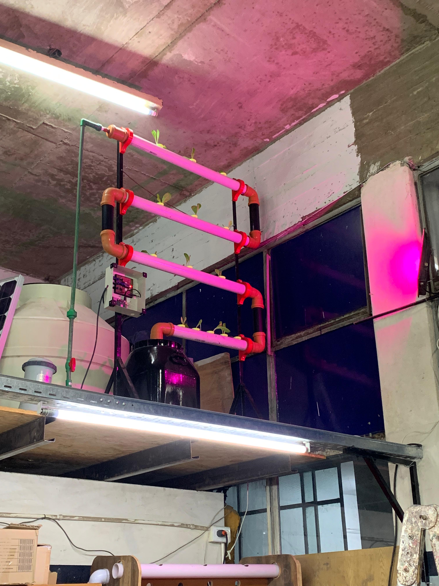

## Añadimos una lampara UV al proyecto

Inmediatamente añadimos los plantines nos dispusimos a añadir una lampara UV al percatarnos de la poca luz solar que entraba a la instancia, para ello decidimos utilizar el último de nuestros disparos de la placa y el mismo timer; aunque hay un problema, el timer es muy impreciso para ello. Por suerte ya planteamos una solución: utilizaremos la Raspberry para que por medio de un script tome el horario local del día y se encargué de mandar un dato vía serial al circuito que le diga si prender o no las lamparas UV.

Anteriormente habiamos utilizado el timer interno del microcontrolador, pero esto es impreciso; no tenemos garantía de sí nuestros cálculos dan en el clavo o no, porque no podemos tener en cuenta la cantidad de tiempo que tardan en ejecutarse las otras lineas de código del circuito. 

#### (es muy fachera)