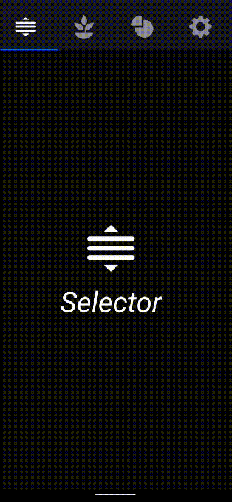
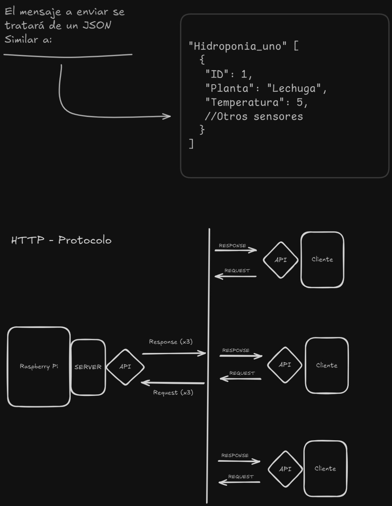

Muy seguramente vayamos añadiendo una sección de "Notas" para añadir actualizaciones y/o ideas nuevas respecto a qué pensamos integrar y que no; algo hablado con nuestro profesor fue integrar una aplicación que estuvimos desarrollando para el que iba a ser nuestro primer proyecto del año, pero se canceló.
Este se trataba de un Indoor, el cuál iba a tener una funcionalidad muy parecida a lo que estamos haciendo con la Hidroponia al tener que, también, tener el control absoluto del ambiente para cuidar de una planta. 

Ésta, al claramente haberse cancelado el proyecto, se le canceló su desarrollo; pero eso no supuso su extinción, se la quiso agregar a nuestro próximo proyecto: Herzarmband. 
Herzarmband iba a ser un reloj/brazalete -nunca se decidió- que tomaría la frecuencia cardíaca y, por aprovechar el código previamente creado para la aplicación. Aunque esto claramente era **muy** impráctico y: sin sentido. 

### ¿Qué más aparte de mostrar la frecuencia cardíaca iba a hacer?

Era un completo sin sentido, salvo que, se pensará añadir algún tipo de algoritmo que predijera y detectará de una forma u otra problemas cardiovasculares -como los hacen muchos en el mercado-  pero eso ya dejaría de ser un proyecto de Electrónica y se convertiría en uno de Software; no es la idea de la materia.

Pero afortunadamente es genuinamente práctica para integrarla en éste proyecto, sirviendo perfectamente como una interfáz gráfica para visualizar en tiempo real por wifi el estado de tus plantas e hidroponia en general. 

A raíz de esto añadiremos la app al proyecto; la idea es crear una comunicación HTTP entre la Raspberry Pi y la Aplicación de celular. Para ello nuestra idea es crear un servidor con **Javascript y Express** (Libreria Backend de Nodejs) que tenga interacción con el recibo de datos que reciba la Raspberry del circuito -ya sea por wifi o algún diferente protocolo de comunicación- y, setear dichos datos con una API la cuál tendrá un endpoint donde la aplicación de celular, la cual también está escrita con Javascript -concretamente con el Framework de **React Native** se conectará.
Muy posiblemente utilizando archivos **JSON** para almacenar la información.

Para la fecha actual, la app luce de la siguiente forma:

El diagrama de bloques que diseñamos para explicar su comunicación HTTP para proponerselo a nuestro profesor es:

Sí usted quiere ver más en profundidad su desarrollo, su repositorio y ramal de Github donde se programo se encuentra [aquí](https://github.com/Sartalan/Indoor-Project/tree/App).