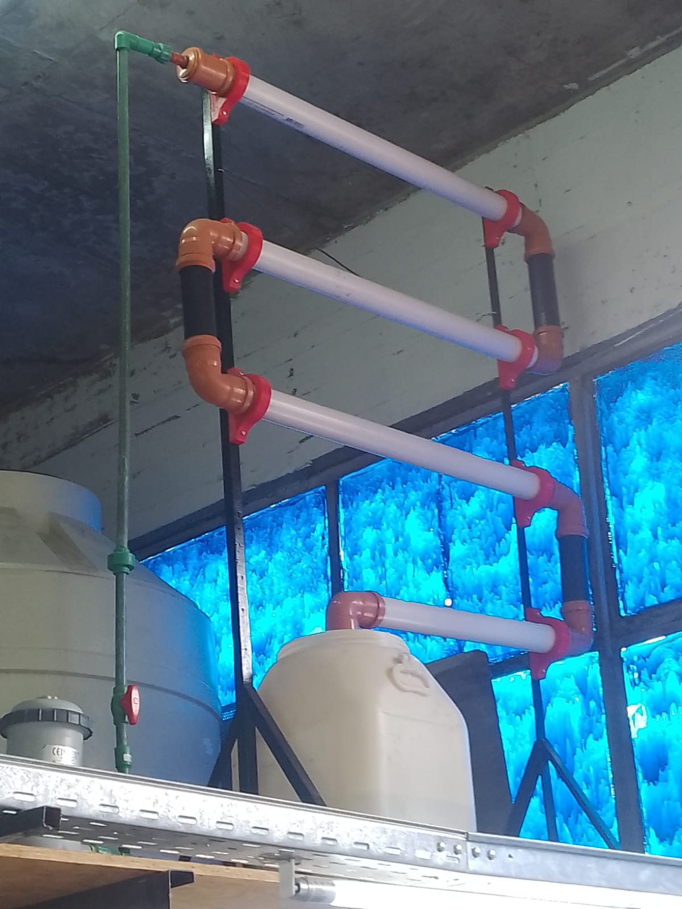

## Hidroponia

#### **Finalmente, lo terminamos; logramos terminar la estructura de la Hidroponia**

Hoy terminamos de instalar de forma funcional la Hidroponia. 
La Hidroponia es, por explicarla de manera sencilla -en la foto se entiende, de igual modo- un "circuito" donde una bomba de agua se encarga de bombear el agua hacía arriba y, al llegar al tope, va bajando por fuerza de la gravedad por unos caños con una leve inclinación. 

Por sí nadie sabe lo que es una hidroponia, la función de este "mecanismo" básicamente permite que, por un lado el agua no se estanque, y por el otro que las plantas esten hidratadas. Al una Hidroponia carecer de tierra justamente se le agregan minerales y/o nutrientes para compensar su carencia. Una Hidroponia -puede ser- una forma muy económica de cultivar plantas en espacios reducidos *si se hace bien*. Nuestra intención en nuestro proyecto es monitorear la mayor cantidad de mágnitudes físicas de ésta.

#### Estructura

La estructura de la Hidroponia no es más que una serie de caños **termofusionados** que le permiten el flujo de agua. En la parte superior de cada caño -aunque no se vea en la foto- contiene unos huecos a escala para contener unos "recipientes/filtros" que las raíces del platín a plantar.

Aunque se vea muy fácil el montaje de la estructura, realmente no lo fue; más de una vez tuvimos algún problema que ocasionó alguna pérdida de agua y tuvimos que replantear alguna parte de su diseño, así que sí alguien piensa armar una: tengalo en cuenta. 

Finalizando con el tema. Le agradecemos mucho a nuestro profesor por habernos ayudado en el armado.