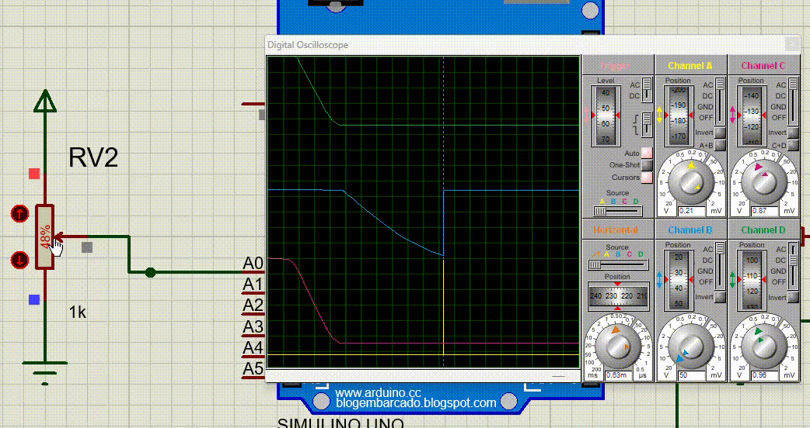
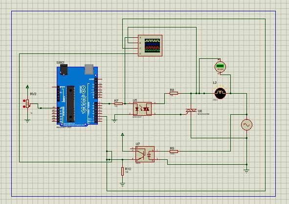
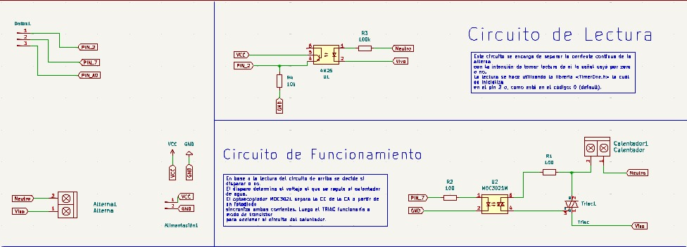
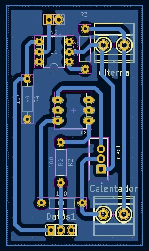

Logramos simular y realizar el circuito correctamente en Proteus, para ello hicimos muchas cosas:

1. Instalamos la *libreria* de Arduino en Proteus para así poder simular correctamente los códigos en este programa, y luego realizamos el circuito correspondiente.

## ¿Qué hicimos?

Quisimos también aprovechar la realización del proyecto para aprobar otra materia; Electrónica Aplicada. La cual nos daba a elegir si simular un circuito o no, así que lo realizamos aplicandolo como solución a un problema en nuestro proyecto; regular la corriente alterna.

Se trata de la realización de un disparo en la señal de alterna a través de la utilización de optoacopladores y triac's.

Ésta es una forma de manipular la onda senoidal de la corriente alterna mediante el uso de la corriente continúa. En nuestro caso se buscó utilizar optoacopladores como medida óptica de separación entre las dos corrientes y, crear un código qué, mediante interrupciones, **supiera** cuando la AC oscila mediante el lado contrario; pero ello suponía otro problema: se debía de saber exactamente y con gran precisión **cuando la onda cruzaba por cero en primer lugar**. Viniendo, recién ahora, lo **interesante** ⊂(◉‿◉)つ.

---

## Explicación 

En primeras antes de hablar del código debemos de hablar del circuito; consta de dos partes: una de monitoreo y otra de control, en la primera se busca tener una lectura constante de la onda senoidal para determinar sí esta cruza por cero, y en la segunda se busca "disparar" hacía la onda senoidal para cortarla, y poder así **regular su intensidad**

¿Cómo la parte de control logra esto?

Para poder determinar cuando disparar o no por el código, básicamente se la divide a la onda senoidal en varias partes.
1. Primero calculando su periodo, utilizando para ello la cuenta:

   

2. Luego, se la divide en 360 partes para así tener un ciclo entero.

   

+ Una vez tenidos estos datos podemos asumir diversas cosas:

1. Un semiciclo de nuestra onda es equivalente a: 360/2.
2. Cada 46μs recorremos 1° de nuestra onda.
3. 46μs x (360/2) Es equivalente al recorrido **total** de tiempo que conlleva un solo semiciclo.

Ahora sí, comencemos con el código. 

```cpp
 #include <TimerOne.h>
    int GradoElectrico = 0;
    
    void GradoZero(){
      GradoElectrico = 0;
    }

    void Disparo() {
      GradoElectrico++;

      // Resto de instrucciones...
      // (Instrucciones de cuando disparar)
      
    }
    
    void setup(){
      attachInterrupt(0, GradoZero, CHANGE);
      Timer1.initialize(46);
      Timer1.attachInterrupt(Disparo);
    }

    void loop(){ 
        // Resto de instrucciones... 
    }
    
    ```

### Básicamente aplicamos todo lo aprendido: 

Comencemos con la función Setup:

```cpp
    attachInterrupt(0,GradoZero,CHANGE);
```

Esta linea de código pertenece a la libreria de TimerOne, y se encarga de inicializar una entrada de datos en el pin 0 (que por default es el 2 y, que cada vez que cambie de HIGH a LOW o viceversa, ejecuta la función GradoZero(), la cual reestablece los valores de la variable GradoElectrico.

```cpp
    Timer1.initialize(46);
```

Le indicamos al programa que inicialice un temporizador de 46μs.

```cpp
    Timer1.attachInterrupt(Disparo)
```


Cada vez que finaliza el temporizador de 46μs se ejecuta la función Disparo()

En resumidas cuentas, el código se encarga de ejecutar un cronometro que cada 46μs ejecuta una función, la cuál aumentará una variable int; pero, recién llegado a un valor LOW en la onda, es decir 180° o, 46μs x 180° de tiempo; el cronometro volverá a reiniciarse y la variable de grados también lo hará junto con ella.


Es decir, este simple código tiene la posibilidad de manipular por completo un ciclo de nuestra onda senoidal partiendola a ésta en 180° al detectar el cruce por cero antes de terminar el ciclo completo. Pudiendo con ello ejecutar scripts de código que tan solo tengan que variar entre los valores de 1 - 180 de la variable int de GradoElectrico y, así, determinando cuando disparar dentro del semiciclo.
- Nota: Esta es una versión *muy* básica del accionamiento del disparo, pero sirve.


Pero básicamente, con este principio podés hacer lo siguiente:



En este caso se tomó el mapeo del valor de un potenciometro el cuál fue sincronizado con un solo semiciclo de la onda senoidal, pudiendo, básicamente elegir cuando disparar.

#### Circuito | Proteus



#### Esquemático | Kicad



#### PCB | Kicad 




### Componentes | Datasheet -por ahora-

1. [Optoacoplador - MOC3021](https://pdf1.alldatasheet.es/datasheet-pdf/view/53870/FAIRCHILD/MOC3021.html)
2. [Optoacoplador - 4N25](https://pdf1.alldatasheet.es/datasheet-pdf/view/158124/VISHAY/4N25.html)
3. [Triac - BT139](https://pdf1.alldatasheet.es/datasheet-pdf/view/16787/PHILIPS/BT139-600.html)