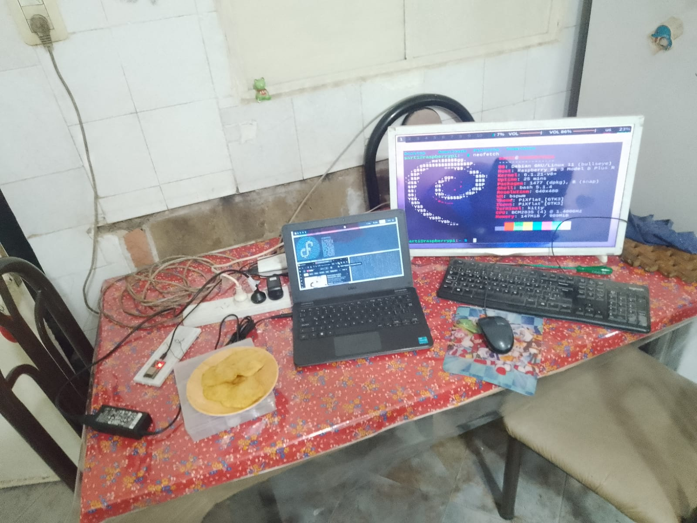

## Comunicación 
#### **Raspberry Pi - Microcontrolador**

Decidimos finalmente comunicar la Raspberry Pi y el Microcontrolador entre sí vía **USB** , este cambio -aunque drástico- es mucho más conveniente para nuestro proyecto, y de igual forma no cambiará demasiado al tener que vernos obligados a utilizar wifi para comunicar la Raspberry Pi con la App.

#### Quedando el gráfico tal que así:


#### **Nota:** En aquel momento se pensaba utilizar el ESP WROOM, luego cambiamos al Arduino Nano al no necesitar del Wifi y, tener mayor acceso a la información de como programarlo.

### Importante

Cuestión: Aquí viene lo importante:
+ Logramos enviar correctamente los datos del microcontrolador a la Raspberry Pi por USB. 

### ¿Cómo se logró esto?

Básicamente controlando el recibo de datos con Python y dependencias de éste, en este caso de **Pyserial**.

```python
import serial
import time

ser = serial.Serial('/dev/ttyACM0', 115200, timeout=1.0)
time.sleep(3)
ser.reset_input_buffer()
print("Serial OK")

try:
    while True:
        time.sleep(0.01)
        if ser.in_waiting > 0:
            line = ser.readline().decode('utf-8').rstrip()
            print(line)

except KeyboardInterrupt:
    print("Close Serial Communication")
    ser.close()
```

En resumidas cuentas el código hace lo siguiente:
+ Se inicializan los modulos para manejar tiempos y datos seriales (Importante instalar pyserial) y luego se procede a generar un bucle el cual esperaría datos por un puerto USB. Siendo éste en concreto el puerto **"/dev/tty/ACM0"**. Es el directorio donde se alojan los puertos en Raspbian (Linux).
+ Luego hace más cosas como decodificar la información en UTF-8 (para mostrar el texto correctamente) pero no son de importancia.
+ Ante una interrupción de teclado se detiene el script.

#### Luego el código en el microcontrolador es el siguiente:

```cpp
#include <Arduino.h>

void setup(){
Serial.begin(115200);
while(!Serial) {}
}

void loop(){
  Serial.println("Mensaje a Raspberry Pi");
  Serial.write("Lol");
  delay(1000);  
}
```

Como ven el código es muy sencillo; los mismos print que se pueden mostrar en consola para debuguear código ya bastan para enviar datos. Lo importante aquí es el **script de Python**

### Setup épico



#### Por sí a alguien le interesa mi rice en Linux *(alto rarito)*, éste se encuentra [aquí](https://github.com/Sartalan/my-linux-dotfiles)