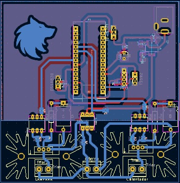
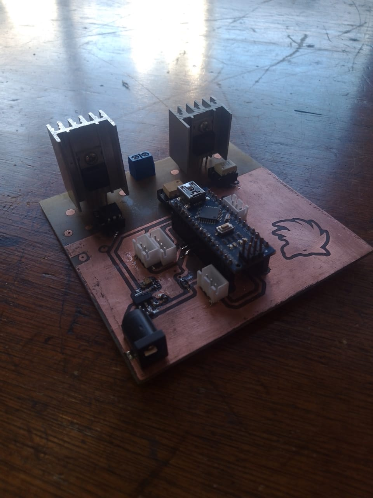

## Buenas!

Hoy hemos terminado de montar el PCB y realizar el código que toma la lectura de todos los sensores y lo envía a través de serial hacia la Raspberry. Comenzando ahora, nuestro nuevo reto: la correcta interceptación de datos de parte de la Raspberry utilizando Python. 
Una forma de resolver este problema de forma sencilla es la que hicimos antes, y es tener el script de Python con la interceptación de datos seriales desde MyCodo, lo cual, aunque solucione nuestro problema, es *muy* poco práctico.

#### Nuestra idea es la siguiente:
+ Queremos que un *único* script de Python se encargue de manejar todos los datos enviados desde el microcontrolador y se encargue de clasificarlos para luego escribirlos en un archivo de cualquier tipo. Luego habrá scripts independientes en los widgets de MyCodo que crearán un sencillo bucle de lectura de datos de un archivo del cuál extraeran el dato a mostrar en pantalla.

Todo esto llevará a que la comunicación entre las partes quede tal que así:

### PCB 

También, para concluir con el tema, les adjuntamos el PCB tanto montado como en KiCad al habernos quedado pendiente la última vez:

---

 