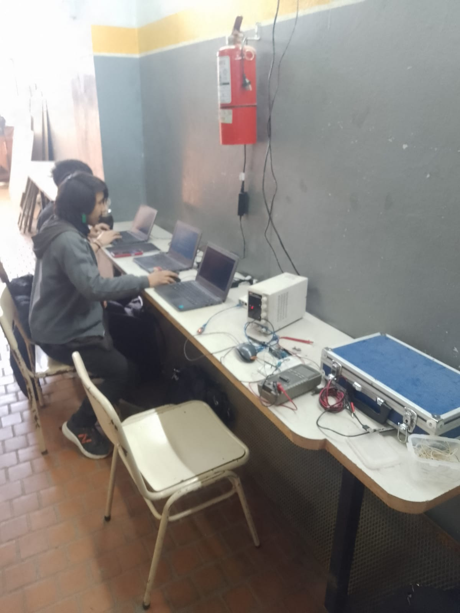
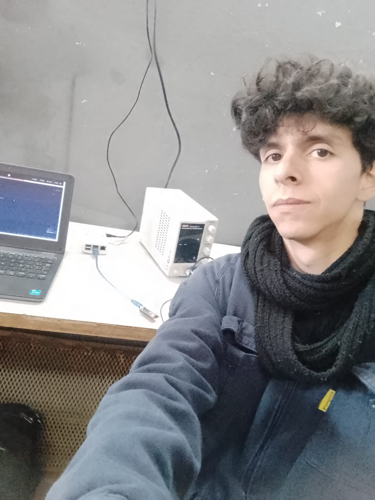

## Avances

#### Entre ayer y hoy comenzamos el desarrollo del segundo PCB

Este consta de más sensores incorporados y la inclusión de un nuevo disparo de triac, llevando por ende un segundo circuito de disparo (con todo lo que ello conlleva; Snubber's, Optoacopladores, Triac's, etc.) Al finalizar el PCB -y sí funciona- daremos una mayor explicación de su funcionamiento

#### Los sensores que vamos a usar son los siguientes:

+ [DS18B20 | **Temperatura**](https://www.analog.com/media/en/technical-documentation/data-sheets/ds18b20.pdf)
+ [DHT11   | **Humedad**](https://www.google.com/url?sa=t&source=web&rct=j&opi=89978449&url=https://www.mouser.com/datasheet/2/758/DHT11-Technical-Data-Sheet-Translated-Version-1143054.pdf&ved=2ahUKEwi20Yb096mIAxVmkZUCHUF5G2QQFnoECBwQAQ&usg=AOvVaw2tdFgaeZgeQmJr3SkJiugP)
+ [M1592 | **Lluvia**](https://cdn.sparkfun.com/datasheets/Sensors/Temp/DS18B20.pdf) 
+ [LDR | **Fotorresistencia**](https://www.youtube.com/watch?v=dQw4w9WgXcQ&pp=ygUJcmljayByb2xs)
+ [YF-S201 | **Caudálimetro**](http://www.mantech.co.za/datasheets/products/yf-s201_sea.pdf)

También un detalle a añadir es que decidimos utilizar el **Arduino Nano.**

## Hoy

Básicamente hicimos todo el esquemático y lo próximo a realizar es el PCB cuando se nos dé el aprobado del mismo.
Testeamos nuevamente la comunicación serial con el Arduino Nano y funcionó correctamente, al igual que cada conexionado independiente de cada sensor con su respectiva forma de conexión, así que todo debería salir de la forma prevista. Seguramente algo salga mal, como siempre. Es parte de ser un técnico electrónico.

Dato a tener en cuenta sí querés que la Raspberry Pi se comunique por USB a un microcontrolador. Tenés que permitirle a tu usuario a acceder al grupo "dialout". Es importante por una cuestión de permisos que solo el super usuario puede brindar.
