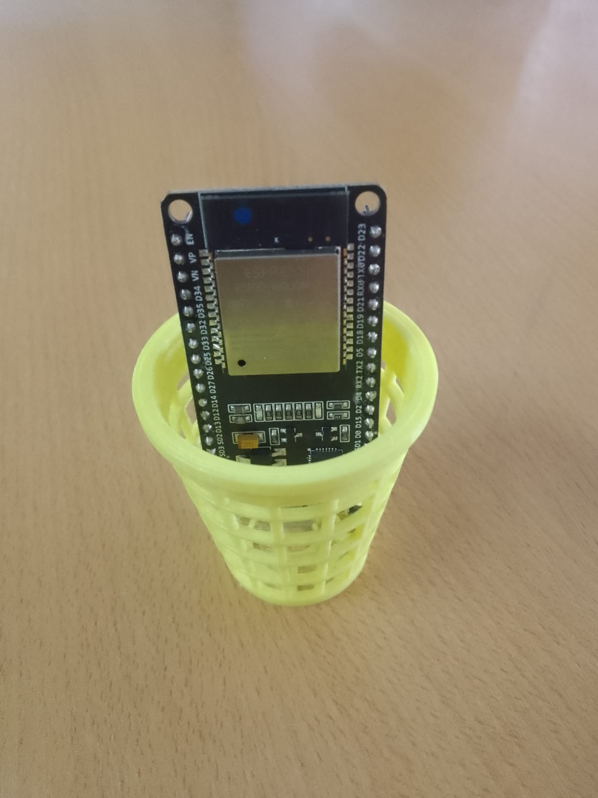

### (｡◕‿◕｡)

Logramos comunicar correctamente la toma de datos de Python con MyCodo, esto fue realmente más fácil de lo que pensamos al no tener que interaccionar con algún otro lenguaje de programación en el proceso. 
El resto será cuestión de tiempo para que se logré.

### Filtro

Hoy fue impreso el filtro/recipiente necesario para alojar los plantines.

### Ideas

Sí logramos unificar todo el proyecto con MyCodo rápidamente, pensamos que podríamos crear un *programa* de escritorio para poder muestrear los datos. Todo esto con la intención de tener más control sobre nuestro código.
Realmente con MyCodo *no sabemos lo que estamos haciendo*, lo cual es una ayuda realmente práctica porque uno no debe de saber como funciona internamente el programa; pero no nos satisface.
Sabemos utilizar una técnologia llamada Tauri. La cual es todo un ecosistema de herramientas que te permiten utilizar Webview (Microsoft) para crear un programa de escritorio con técnologia web y, manejar todo su Backend utilizando el lenguaje de bajo nivel **Rust**.
Pensamos que haría que el proyecto se sintiera menos incompleto y que sería grandioso que tuviese un programa propio también.

Aparte, ya tenemos un código; [Spectrum-IOT_WebPage](https://sartalan.github.io/Spectrum-IOT_WebPage/)

Spectrum-IOT_WebPage es una aplicación web que fue creada para monitorear la lectura de datos que ésta recibiera de una casa completamente automátizada para que unos robots se movilizarán de forma autonóma en ella; como es de imaginar, el *proyecto fue cancelado*. Es justamente por ello que nos gustaría reutilizar el código y adaptarlo al diseño de la App (por una cuestión de consistencia). 
Aunque también seria increible que pudiese ser hecho para que, a diferencia de la app, se pueda modificar alguna parte del código del microcontrolador y regular mágnitudes. Sería altamente práctico como una interfaz visual táctil que pudiese estar instalada en la Raspberry y, simplemente con un par de touch's y la misma navegación intuitiva de la aplicación web, pudiese ser controlado. 

Aunque muy seguramente no lleguemos con el tiempo para ello; pero puede que sea un buen código Open Source del que se pueda sacar mucho provecho sí alguien así lo quiere.  
