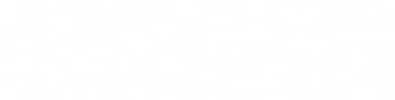
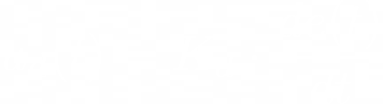

## Informe Sistemas de Control

## Resumen
Realizamos exitosamente un proyecto que incluyera un Controlador PID, el cuál es un tipo de controlador dedicado a controlar y regular un proceso de cualquier tipo utilizando para ello tres componentes; integrales, derivativos y proporcionales. En base a dichos componentes se buscará regular una variable de salida para ajustarla a su “setpoint” el cuál sería el valor más idealmente deseado en nuestro sistema de control y, siendo el controlador PID uno de los sistemas más confiables y precisos para estas aplicaciones.

## Proyecto
En base al concepto previamente explicado realizamos como proyecto de la materia un controlador PID que mide la temperatura de una lampara de vacio utilizando un sensor de temperatura LM35 y, utilizando un Arduino Nano como microcontrolador, planteamos toda la lógica necesaria para ello manejando interrupciones en el proceso. Así el Arduino hará todos los procesos/cálculos referentes al PID y prenderá o apagará una lampara de vacio a partir de un disparo del microcontrolador utilizando para ello un dimmer AC, en base a ello irá variando la temperatura de la lampara de vacio, generando un sistema cerrado.

## Componentes

+ Sensor de temperatura  LM35 
+ Microcontrolador  Arduino Nano
+ Cooler
+ (Dispositivo a Calentar | Lampara de vacio)

## Diagrama de Bloques

## Funcionamiento

### Circuito
Nuestro circuito es un Dimmer AC e interrupciones.
	Un Dimmer AC es un circuito preparado para variar la corriente alterna a gusto. 
	Nosotros nos encargamos de crear un Dimmer desde cero y lo utilizamos 	mediante interrupciones. Las interrupciones son una carácteristica que tienen 	algunos microcontroladores para interrumpir el flujo normal del código de 	manera repentina debido a una señal externa la cual se le indique.

	En nuestro caso nos encargamos de ejecutar la "interrupción" cada vez que 	exista un cruce por cero; mientras tanto, el resto del código -el cual ejecuta las 	operaciones PID- se mantiene en segundo plano. Es decir, el (Dispositivo a Calentar) (en este caso una lampara de vacio) elige si encenderse o no cada un 	vez que exista un cambio de polaridad; el resto del tiempo -cuando no se 	enciende o apaga la lampara- las operaciones que integran el sistema de control 	PID determinan sí es conveniente o no, encender o apagar la lampara la 	próxima vez que se detecte un cambio de polaridad.

### Código
A nuestro código se le fijan las constantes PID de manera manual (es decir, ajustando las variables), justo antes de cada compilación y luego se encargan de realizarlas ecuaciones correspondientes al sistema de control PID.

## Ecuaciones | PID

La sigla 'PID' provienen de las palabras: (Proporcional,integral, derivada). Cada una de estas constantes actúa de manera diferente frente a un error:

    ### Formula | Proporcional
         

    + **Proporcional:** Esta actua aplicando una corrección directamente proporcional al error presente en el sistema, es decir,  que mientras mayor sea el error le corresponderá una mayor corrección de igual mágnitud.
    
    ---

    ### Formula | Integral
        
    + **Integral:** Esta actúa en función del tiempo, intentando corregir el error acumulado a lo largo del tiempo, si este persiste a lo largo de un periodo el controlador integral aplica una mayor magnitud de correccion. 
    
    
    ---

    ### Formula | Derivada
                

    + **Derivada:** Esta actua según la tasa de cambio del error presente, es decir, que trata de predecir el comportamiento futuro del mismo y aplica una corrección en función de que tan rapido éste cambie.

    ---

### Gráfico PID | Arduino
	--imagen

## Integrantes

+ Barrera Alan
+ Fariña Jorge
+ Dominguez Gabriel

