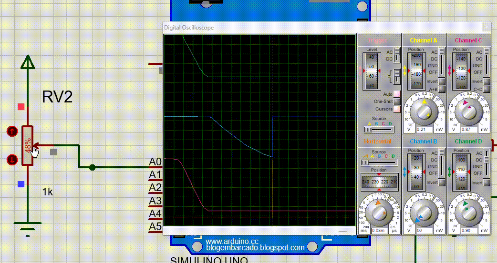

### Introducción

En este apartado hablaremos del disparo; la carácteristica más interesante de nuestro proyecto. El "Disparo" es la capacidad que le dimos al circuito para, mediante Software, poder "cortar" la onda senoidal y con ello variar el valor del voltaje de la corriente alterna. 

Aún no hablaremos de su accionamiento "real" en el proyecto. Esto es una explicación teórica con respecto al como nosotros logramos solucionar un problema.

---

### Explicación básica

En primeras antes de hablar del código debemos de hablar del circuito; consta de dos partes: una de monitoreo y otra de control, en la primera se busca tener una lectura constante de la onda senoidal para determinar sí esta cruza por cero, y en la segunda se busca "disparar" hacía la onda senoidal para cortarla, y poder así **regular su intensidad**

¿Cómo la parte de control logra esto?

Para poder determinar cuando disparar o no por el código, básicamente se la divide a la onda senoidal en varias partes.
Primero calculando su periodo, utilizando para ello la cuenta:


+ Luego, se la divide en 360 partes para así tener un ciclo entero.


+ Una vez tenidos estos datos podemos asumir diversas cosas:

 1. Un semiciclo de nuestra onda es equivalente a: 360/2.
 2. Cada 46μs recorremos 1° de nuestra onda.
 3. 46μs x (360/2) Es equivalente al recorrido **total** de tiempo que conlleva un solo semiciclo.

Ahora sí, comencemos con el código. 

```cpp

    #include <TimerOne.h>
    
    int GradoElectrico = 0;
    
    void GradoZero(){
      GradoElectrico = 0;
    }

    void Disparo() {
      GradoElectrico++;

      // Resto de instrucciones...
      // (Instrucciones de cuando disparar)
      
    }
    
    void setup(){
      attachInterrupt(0, GradoZero, CHANGE);
      Timer1.initialize(46);
      Timer1.attachInterrupt(Disparo);
    }

    void loop(){ // Resto de instrucciones...}
```

Básicamente aplicamos todo lo aprendido: 
Comencemos con la función Setup:

```cpp
    attachInterrupt(0,GradoZero,CHANGE);
```
      
Esta linea de código pertenece a la libreria de TimerOne, y se encarga de inicializar una entrada de datos en el pin 0 que por default es el 2 y, que cada vez que cambie de HIGH a LOW o viceversa, ejecuta la función GradoZero(), la cual reestablece los valores de la variable GradoElectrico.

```cpp
    Timer1.initialize(46);
```
      
Le indicamos al programa que inicialice un temporizador de 46μs.

```cpp
    Timer1.attachInterrupt(Disparo)
```
          
Cada vez que finaliza el temporizador de 46μs se ejecuta la función Disparo()

En resumidas cuentas, el código se encarga de ejecutar un cronometro que cada 46μs ejecuta una función, la cuál aumentará una variable int; pero, recién llegado a un valor LOW en la onda, es decir 180° o, 46μs x 180° de tiempo; el cronometro volverá a reiniciarse y la variable de grados también lo hará junto con ella.


Es decir, este simple código tiene la posibilidad de manipular por completo un ciclo de nuestra onda senoidal partiendola a ésta en 180° al detectar el cruce por cero antes de terminar el ciclo completo. Pudiendo con ello ejecutar scripts de código que tan solo tengan que variar entre los valores de 1 - 180 de la variable int de GradoElectrico y, así, determinando cuando disparar dentro del semiciclo.

- Nota: Esta es una versión *muy* básica del accionamiento del disparo, pero sirve.

### Ejemplo



En este ejemplo estamos viendo la variación que puede lograr un disparo en la onda senoidal simulado en Proteus.
Para esta simulación se utilizo el valor mapeado en código de un potenciometro con respecto a los 180° del semiciclo de la onda senoidal.

---

### Aplicación real

Retomando el informe de nuestro proyecto, nuestro circuito real no terminó por utilizar como carácteristica
la regulación de voltaje en su aplicación. Esto ocurrió por diversos cambios a lo largo del proyecto que, de manera repentina, nos forzó a terminar por usar los disparos para prender cosas sencillas, de las que realmente con el uso de 
relés ya se podría haber solucionado sin necesidad de un circuito tan complejo. De igual forma no es nada desmotivante; la posibilidad de usarlo sigue, y por suerte el problema está solucionado.

### Explicación más a fondo

El circuito consta de dos partes -como se dijo en la introducción- una de monitoreo y otra de disparo.

#### Monitoreo

+ La de monitoreo tiene como único fin captar el cruce por cero del semiciclo. Cada vez que dicho cambio se realice, 
un optoacoplador (4N25) se encargará de enviar un cambio de estado lógico con la intención de accionar un pin de interrupción del microcontrolador. En el caso del Arduino Nano solo existen dos: el pin de interrupción 2 y el pin de interrupción 3. En nuestro circuito final terminamos por utilizar el pin 3.

  La carácteristica más importante que tiene una interrupción en el uso de un microcontrolador es que, uno tiene la posibilidad de que todo el flujo de trabajo del código opere con normalidad, pero apenas haya un cambio lógico en X pin, se interrumpa el funcionamiento de *todo* el código con tal de priorizar una nueva función que actuará cuando esta interrupción sea dada. En el caso de nuestro código la nueva función solo resetearia el valor de grado eléctrico, para luego hasta la siguiente interrupción se siga teniendo un correcto seguimiento de la onda senoidal. 

#### Disparo

+ La de disparo se encarga únicamente de accionar un TRIAC que cerrará un circuito AC en base a la señal lógica que reciba de un optoacoplador (MOC3021). Este optoacoplador será accionado por un pin del Arduino.

    La sección de disparo también tiene muchas integraciones de seguridad extra que fuimos incorporando a medida que pasaba el tiempo y nuestro circuito seguía estallando.


### Conexionado básico


