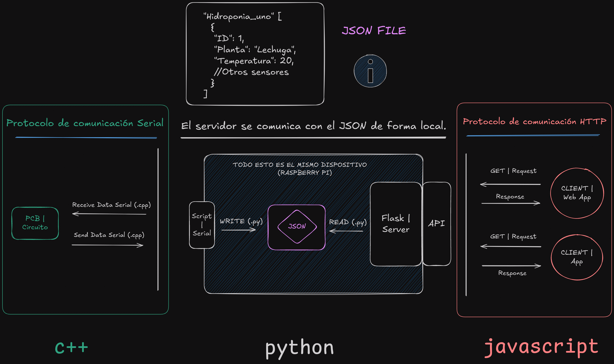

# Software

Este informe estará orientado completamente al funcionamiento *teorico* del proyecto. 

Nuestra idea es que este informe sirva para sentar unas bases teoricas con respecto al funcionamiento del proyecto y la comunicación entre las partes. Sí por casualidad se buscase entender el código linea por linea, éste está altamente documentado en los mismos scripts donde este se encuentra. Siempre se buscó tener un seguimiento y/o explicación de la funcionalidad de cada script dentro de los mismos scripts con comentarios.

## Introducción

Siempre hablar y/o documentar un software es dificil, y esta tampoco es la excepción. Hablar de Software es complejo. Nunca nadie sabe por donde empezar. 

Por ello mismo decidimos el siguiente orden: primero comenzaremos con el código del circuito, no explicaremos el funcionamiento del disparo al ya haber sido explicado en el apartado de "Hardware", pero sí hablaremos sobre el protocolo de comunicación serial y la comunicación entre las partes.

Luego hablaremos sobre el servidor, el protocolo de comunicación http y la explicación teórica de como este logra comunicarse correctamente con la aplicación de celular y la aplicación web.

Y por último, -y a modo de mención honorifica- una breve explicación teórica de cada archivo importante del proyecto en formato de arbol ascii junto con cada técnologia y/o herramienta extraña utilizada. *La intención es que quién no esté familiarizado con este entorno de trabajo no se encuentre tan perdido.*

---

## Hidroponia

### Entorno de Trabajo

El Software del circuito está creado con *Platformio*. Este es un entorno de desarrollo para embebidos altamente superior al IDE de Arduino y que permite ejecutar operaciones mediante terminal, una herramienta altamente eficiente cuando tu proyecto es programado remotamente.
Luego como editor de código e IDE utilizamos Neovim con el gestor de paquetes "lazyvim" para una mayor fácilidad de uso y comodidad.

La mayor parte de la experiencia de trabajo fue remota; utilizamos Linux con la distro de "Fedora Server" (por el bajo consumo en memoria), y le hicimos un [rice]('') para así crearnos un buen entorno de trabajo. 

En un inicio esto *no* era del todo asi, pero a medida que el proyecto fue creciendo no hubo de otra que aprender a manejar correctamente estos entornos de trabajo.


### Embebido

Bueno... *Comencemos por el Software;* comenzaremos con una explicación sencilla de la comunicación entre las partes:

Existe un circuito, dicho circuito se encarga de activar/desactivar una lampara UV y una bomba de agua mientrás simúltaneamente toma la lectura de diferentes sensores. Este a su vez, recibe y envía datos a una Raspberry por el protocolo de comunicación serial, es decir, el cable USB.

La comunicación serial es *muy* importante en nuestro proyecto; ésta se encarga de, en el caso de recibir la orden, activar o desactivar la lampara UV en base al horario local de la Raspberry, y a su vez: de enviarle las lecturas de los sensores a la Raspberry. La lectura será "filtrada" por un script de Python para diferenciar de que sensor proviene cada mágnitud y escribirá estas lecturas en un archivo JSON cada cierta cantidad de tiempo. 

JSON es un formato de texto y extensión de archivo creado con el fín de almacenar e intercambiar datos, por ello es muy común ver que es utilizado en bases de datos no relacionales y la mayor parte de los lenguajes de programación tienen algún módulo y/o biblioteca preparada para manejarlos. *En nuestro caso le dimos el mismo fín.* 

Nuestro archivo JSON es utilizado para ser leído cada vez que un servidor HTTP -que está pendiente de éste- reciba una Request (o solicitud) de datos a una url concreta (en este caso '/Hidroponia'). Cuando el servidor reciba *de cualquier cliente* una Request de datos, este leerá el archivo JSON y devolverá una Response. 

Retomando al script del servidor; nuestro servidor está creado en Python, es un mismo script de la Raspberry y utiliza *flask*, la cual es una biblioteca de Python para manejar servidores y, concretamente el protocolo de comunicación HTTP, con una mayor fácilidad.

Pero... El Servidor no es el único Software que se encarga de tomar la lectura de nuestros sensores, justamente para ello viene el siguiente apartado. 

### MyCodo

Saliéndonos del terreno de los servidores, nuestro proyecto incluye MyCodo, pero... 

#### ¿Qué es MyCodo?

MyCodo es un Software Open Source creado para monitorear plantaciones de hongos y que uno puede instalar en una Raspberry, y este no es más que una *aplicación web*. MyCodo es todo un mundo y ecosistema integrado, pero lo que nos consta de importancia en este informe es que nos sirvió como medio de *monitoreo de datos* prevío a la creación de nuestros software propios.

MyCodo como Software admite "Widget" que no son más que código prehecho con el proposito de tomar lecturas de sensores concretos; pero en nuestro no nos sirvieron en absoluto al no ser tan comunes nuestros sensores, salvo un único Widget: El Widget que admite script's de Python.

Ese Widget te permite una libre personalización, teniendo la posibilidad de habilitar el script de Python que vos quieras. Fue justamente este Widget el que utilizamos; creamos un script que tomase la lectura del archivo JSON y mostrará sus valores en pantalla, incluyendo los del *Sense Hat*, pero... Todavía no explicamos que es el Sense Hat.

### Sense Hat

#### ¿Qué es el Sense Hat?

Resolvamos la duda. El Sense Hat no es más que un modúlo comprado que uno puede incluir en su Raspberry Pi el cual incluye librerias para su uso. El Sense Hat es una *estación metereológica*, sí es que uno así lo desea. Incluye una múltiple cantidad de sensores, y tambíen un display LCD de 8x8 con color el cual utilizamos para mostrar figuras y/o gráficos frikis.

#### Para un mayor entendimiento de la comunicación entre las partes, le adjuntamos el siguiente gráfico:



---

## Clientes

### Introducción

Los clientes son dos; una aplicación web y una aplicación de celular. Aún el código para estas fechas sigue incompleto; son muy verdaderamente ambiciosos. En un fúturo pensamos añadir una sección de "Anexo" justo por debajo de la sección de "Informe Final" donde documentaremos más en detalle el funcionamiento de cada Software.

Ahora, retomemos la teoría de comunicación de los Software.

Ambos Software funcionan como "clientes" dentro de la comunicación HTTP. Sus códigos deben -y funcionan- de alguna forma para incluir el número de IP y el "/Hidroponia" donde solicitarán (Request) los datos que estos necesitan para operar correctamente. 

Ambos también recibirán una respuesta (Response) que le traerá los datos que ellos solicitarón.

Para la fecha ambos Software funcionan como *monitoreo de datos*. Nunca se esperó una interacción real con el circuito -al no existir éste aún-, pero puede que en un fúturo se le haga un Ánexo para ello.  

### App

La Aplicación de celular está creada con **React Native**. 

React Native es un Framework creado por Meta -Facebook en su tiempo- creado como alternativa multiplataforma para crear aplicaciones de celular con una sintáxis muy similar a la creación de sitios web. Todo ello con el proposito de que los trabajadores de Meta tuvieran una mayor fácilidad para adaptarse a este nuevo desafio. 

En resumen: el proyecto *fracasó estrepitosamente* y Meta decidió convertirlo en un proyecto Open Source, a la comunidad le encantó, y decidieron continuarlo. Actualmente es de las técnologias con mayor salida laboral. 

Sí se quiere una explicación del código más en detalle, éste se encuentra [aquí](https://github.com/Sartalan/Hidroponia-Project/tree/App).

No hablaremos mucho más sobre el tema al no ser el fín del informe.

### Web 

La aplicación Web está creada con *React*.

React es una biblioteca utilizada en la creación de páginas web con el proposito de reutilizar código como "Componentes". React Native está basado en React, obviamente. Tienen una sintáxis muy similar y, el flujo de código al igual que su renderizado son altamente similares. No hay mucho más que decir, el código de la aplicación web está [aquí](https://github.com/Sartalan/Hidroponia-Project/tree/Web).

## Proyecto | Workflow
---
### Platformio | Código

```text
Code/
└── Embedded Code
    ├── include
    │   └── README
    ├── lib
    │   └── README
    ├── platformio.ini
    ├── src
    │   └── main.cpp
    └── test
       └── README
```

### Raspberry Pi | Código

``` text
Code/
└── Raspberry Pi Code
    ├── app.py
    ├── app.py.save
    ├── __pycache__
    │   ├── app.cpython-311.pyc
    │   ├── app.cpython-312.pyc
    │   └── app.cpython-39.pyc
    └── src
        ├── data
        │   ├── hidroponia_uno.json
        │   └── weather.json
        ├── mycodo_test.py
        ├── __pycache__
        │   └── serial.cpython-312.pyc
        ├── serial_communication.py
        └── weather.py
```

### Init File

``` text
Code/
├── Embedded Code/
│
├── init.sh
│
└── Raspberry Pi Code/
```